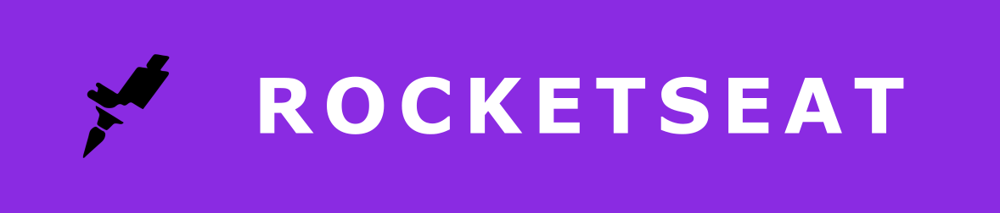

<h1 align="center">
  Hi there, i'm Pedro Lucas
	 
   
	Welcome to my profile!
	
</h1>

  

<h3 align="left">For a better experience, select the display language for this profile below (if necessary):</h3>
  

    <table align="left">
      <tr><td><a href="README.md">English / Inglês</a></td></tr>
      <tr><td><a href="readme_pt-br.md">Portuguese / Português</a></td></tr>
    </table> 
  

 
  
  
  
#

  

- 🔭 I'm currently a full-stack web development student, passionate about front-end technologies and delighted with the power of programming
- 🌱 I’m learning and going deeper first into HTML5, CSS3 and JavaScript
- 📚 I'm graduated in civil engineering, but i want to become a high level programmer, so i'm on career transition and very happy and enthusiastic about this decision
- 💬 Ask me about HTML5 and CSS3
- 📫 How to reach me: pedrollopesb@gmail.com
- ⚡ Fun fact: I want to be an 🏹 archer and a 🎷 saxophone player, like my next hobbies
- ❤️ Interests: 💻 watch movies, series and animes, 🎶 listen to music, 📚 read books, 🎮 play video games and ✈️ travel

 

  <a href="https://github.com/pedrollopesb">
  
  

#
	

  

	
	
<h3 align="left">Current languages and tools:</h3>
  

    
    
    
  
	
	
<h3 align="left">Next Steps:</h3>
  

    
    
      
      
      
    
    
    	  
     
  
    
    
      
    
    
    
       
      
      	  
  

#
		
<h3 align="left">Social medias:</h3>
  

   <!--
   
 	 -->
     
        
       
  

   
<h3 align="left">Connect with me:</h3>
  

     
     
      
       	  	  
  

  

<h1 align="center">
  Thank you and come back soon! 🖖
  	
    </h1> 	  
